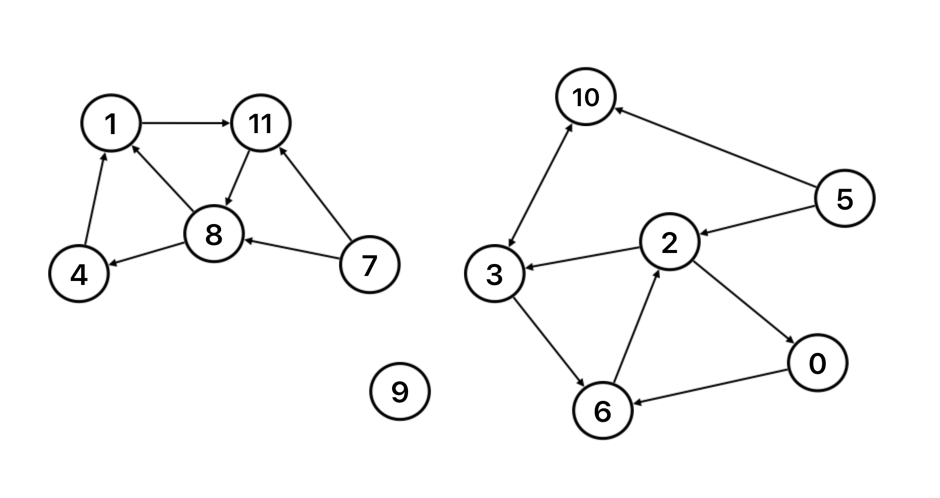

# 자료구조와 알고리즘 5주차 과제 - 방향 그래프

1. 정점 12개이고, 간선 16개가 다음과 같이 주어졌을 경우, 방향 그래프는 어떤
   모양이 되는지 그림으로 그려주세요.

```
8 4
2 3
1 11
0 6
3 6
10 3
7 11
7 8
11 8
2 0
6 2
5 2
5 10
3 10
8 1
4 1
```


2. 도달성을 확인하는 객체 `DirectedDFS.js`를 완성해 주세요.

3. 방향그래프에서 순환을 가졌는지 판별하는 객체 `DirectedCycle.js`를 완성해 주세요.
